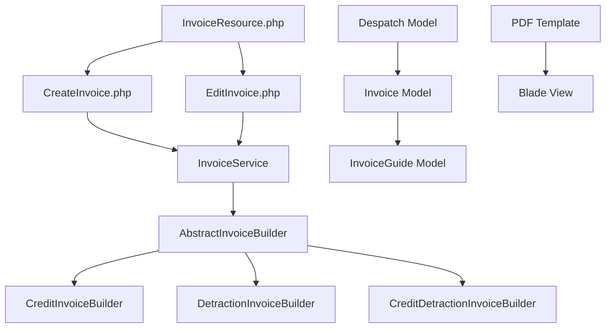
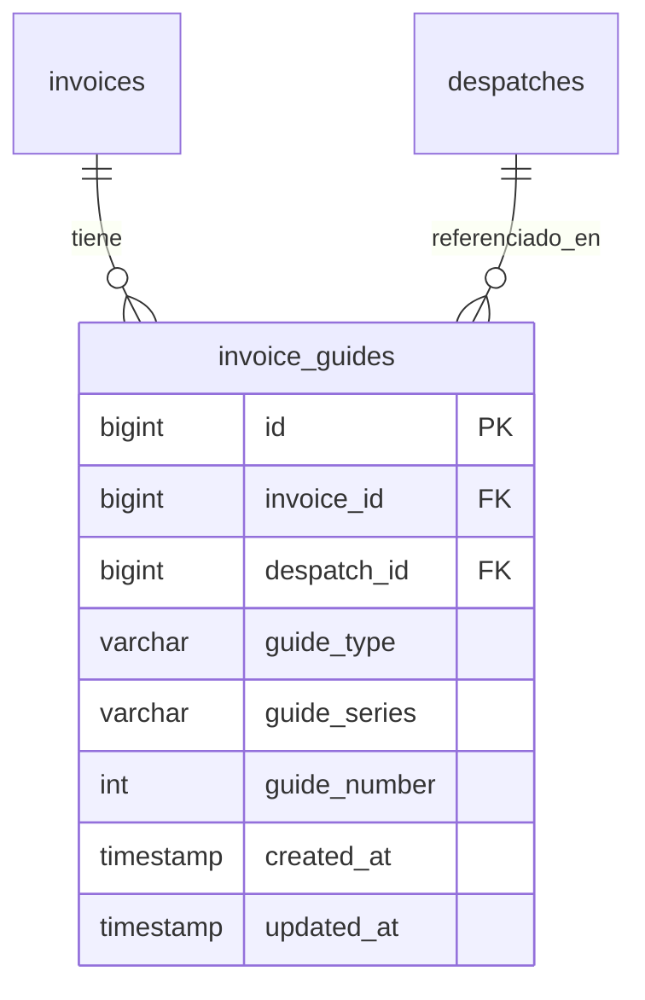
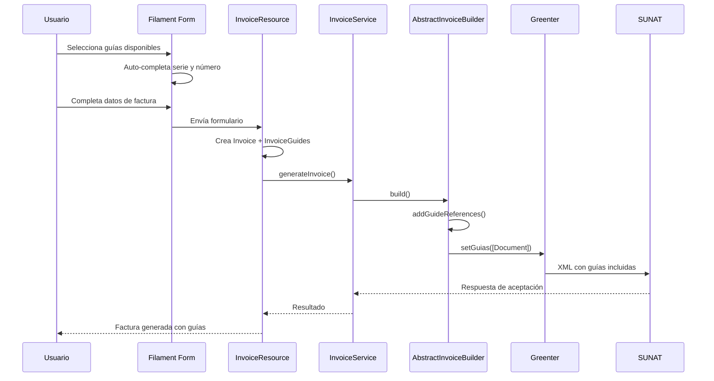

# Diseño Técnico: Integración de Referencias a Guías de Remisión en Facturas

## 1. Resumen Ejecutivo

### Objetivo
Implementar la funcionalidad para referenciar guías de remisión disponibles al emitir facturas electrónicas, siguiendo las especificaciones de SUNAT y utilizando la librería Greenter para incluir las referencias correctamente en el XML de la factura.

### Alcance
- Modificar el formulario de creación de facturas para incluir selector de guías disponibles
- Actualizar el modelo de datos para almacenar las referencias
- Modificar los builders de facturas existentes para incluir las guías en el XML
- Actualizar la vista PDF para mostrar las guías referenciadas
- Mantener toda la funcionalidad existente sin alteraciones

## 2. Arquitectura de Solución

### Patrón de Diseño
La solución seguirá el patrón arquitectónico existente del sistema:
- **Service Layer Pattern**: Lógica de negocio en servicios especializados
- **Builder Pattern**: Extensión de builders existentes para incluir guías
- **Observer Pattern**: Sin modificaciones a observers existentes
- **Resource Pattern**: Extensión del InvoiceResource actual

### Componentes Afectados



## 3. Diseño de Base de Datos

### Nueva Tabla: invoice_guides

```sql
CREATE TABLE invoice_guides (
    id BIGINT UNSIGNED AUTO_INCREMENT PRIMARY KEY,
    invoice_id BIGINT UNSIGNED NOT NULL,
    despatch_id BIGINT UNSIGNED NOT NULL,
    guide_type VARCHAR(2) DEFAULT '31' COMMENT 'Tipo de documento: 31 = Guía de Remisión Transportista',
    guide_series VARCHAR(4) NOT NULL,
    guide_number INT NOT NULL,
    created_at TIMESTAMP NULL DEFAULT NULL,
    updated_at TIMESTAMP NULL DEFAULT NULL,
    
    INDEX idx_invoice_guides_invoice_id (invoice_id),
    INDEX idx_invoice_guides_despatch_id (despatch_id),
    UNIQUE KEY unique_invoice_guide (invoice_id, despatch_id),
    
    FOREIGN KEY (invoice_id) REFERENCES invoices(id) ON DELETE CASCADE,
    FOREIGN KEY (despatch_id) REFERENCES despatches(id) ON DELETE CASCADE
);
```

### Relaciones del Modelo



## 4. Implementación del Modelo

### InvoiceGuide Model

```php
<?php

namespace App\Models;

use Illuminate\Database\Eloquent\Model;
use Illuminate\Database\Eloquent\Relations\BelongsTo;

class InvoiceGuide extends Model
{
    protected $fillable = [
        'invoice_id',
        'despatch_id',
        'guide_type',
        'guide_series',
        'guide_number',
    ];

    public function invoice(): BelongsTo
    {
        return $this->belongsTo(Invoice::class);
    }

    public function despatch(): BelongsTo
    {
        return $this->belongsTo(Despatch::class);
    }
}
```

### Extensión del Invoice Model

```php
// Agregar relación en app/Models/Invoice.php
public function invoiceGuides(): HasMany
{
    return $this->hasMany(InvoiceGuide::class);
}

public function referencedDespatches(): BelongsToMany
{
    return $this->belongsToMany(Despatch::class, 'invoice_guides')
                ->withPivot('guide_type', 'guide_series', 'guide_number')
                ->withTimestamps();
}
```

## 5. Modificaciones en Filament Resource

### InvoiceResource Form Schema

```php
// Nuevo campo en el formulario (sección "Guías de Remisión")
Section::make('Guías de Remisión Disponibles')
    ->schema([
        Repeater::make('invoice_guides')
            ->label('Guías Referenciadas')
            ->relationship()
            ->schema([
                Select::make('despatch_id')
                    ->label('Guía de Remisión')
                    ->options(function () {
                        return Despatch::query()
                            ->where('accepted_by_sunat', true)
                            ->whereDoesntHave('referencingInvoices')
                            ->get()
                            ->mapWithKeys(function ($despatch) {
                                return [
                                    $despatch->id => "GR {$despatch->series}-{$despatch->number} - {$despatch->client->business_name}"
                                ];
                            });
                    })
                    ->searchable()
                    ->required()
                    ->afterStateUpdated(function ($state, $set) {
                        if ($state) {
                            $despatch = Despatch::find($state);
                            if ($despatch) {
                                $set('guide_series', $despatch->series);
                                $set('guide_number', $despatch->number);
                            }
                        }
                    }),
                
                TextInput::make('guide_series')
                    ->label('Serie')
                    ->required()
                    ->disabled()
                    ->dehydrated(),
                
                TextInput::make('guide_number')
                    ->label('Número')
                    ->required()
                    ->disabled()
                    ->dehydrated(),
                
                Hidden::make('guide_type')
                    ->default('31'),
            ])
            ->columns(3)
            ->addActionLabel('Agregar Guía de Remisión')
            ->collapsible()
            ->cloneable(false)
            ->reorderable(false),
    ])
    ->visible(fn (string $operation): bool => $operation === 'create')
    ->collapsible(),
```

## 6. Extensión de Invoice Builders

### Modificación en AbstractInvoiceBuilder

```php
// app/Services/Invoice/Builders/AbstractInvoiceBuilder.php
protected function addGuideReferences(Invoice $invoice): void
{
    if ($invoice->invoiceGuides->isNotEmpty()) {
        $guideDocuments = [];
        
        foreach ($invoice->invoiceGuides as $invoiceGuide) {
            $guideDocuments[] = (new Document())
                ->setTipoDoc($invoiceGuide->guide_type)
                ->setNroDoc($invoiceGuide->guide_series . '-' . $invoiceGuide->guide_number);
        }
        
        $this->invoice->setGuias($guideDocuments);
    }
}

// Modificar el método build() para incluir las guías
public function build(): GreenterInvoice
{
    $this->setBasicInformation();
    $this->setClient();
    $this->setItems();
    $this->setTotals();
    $this->setLegends();
    $this->addGuideReferences($this->invoice); // Nueva línea
    
    return $this->invoice;
}
```

### Implementación en Cada Builder Específico

Los builders existentes (`CreditInvoiceBuilder`, `DetractionInvoiceBuilder`, `CreditDetractionInvoiceBuilder`) heredarán automáticamente esta funcionalidad sin modificaciones adicionales.

## 7. Modificación del InvoiceService

### Extensión del Método de Creación

```php
// app/Services/InvoiceService.php
public function generateInvoice(Invoice $invoice): array
{
    try {
        // Lógica existente sin cambios...
        $builder = $this->getInvoiceBuilder($invoice);
        $greenterInvoice = $builder->build();
        
        // Las guías ya están incluidas automáticamente por el builder
        
        // Continuar con el proceso existente...
        return $this->submitToNubefact($greenterInvoice, $invoice);
        
    } catch (Exception $e) {
        // Manejo de errores existente...
    }
}
```

## 8. Vista PDF Actualizada

### Modificación de la Plantilla Blade

```html
<!-- resources/views/invoices/pdf.blade.php -->
@if($invoice->referencedDespatches->isNotEmpty())
<div class="section">
    <h3>Guías de Remisión Referenciadas</h3>
    <table class="table-simple">
        <thead>
            <tr>
                <th>Tipo</th>
                <th>Serie-Número</th>
                <th>Cliente</th>
                <th>Fecha Emisión</th>
            </tr>
        </thead>
        <tbody>
            @foreach($invoice->referencedDespatches as $despatch)
            <tr>
                <td>Guía de Remisión</td>
                <td>{{ $despatch->series }}-{{ $despatch->number }}</td>
                <td>{{ $despatch->client->business_name }}</td>
                <td>{{ $despatch->emission_date->format('d/m/Y') }}</td>
            </tr>
            @endforeach
        </tbody>
    </table>
</div>
@endif
```

## 9. Migración de Base de Datos

### Archivo de Migración

```php
<?php
// database/migrations/xxxx_create_invoice_guides_table.php

use Illuminate\Database\Migrations\Migration;
use Illuminate\Database\Schema\Blueprint;
use Illuminate\Support\Facades\Schema;

return new class extends Migration
{
    public function up(): void
    {
        Schema::create('invoice_guides', function (Blueprint $table) {
            $table->id();
            $table->foreignId('invoice_id')->constrained()->cascadeOnDelete();
            $table->foreignId('despatch_id')->constrained()->cascadeOnDelete();
            $table->string('guide_type', 2)->default('31');
            $table->string('guide_series', 4);
            $table->integer('guide_number');
            $table->timestamps();
            
            $table->index(['invoice_id']);
            $table->index(['despatch_id']);
            $table->unique(['invoice_id', 'despatch_id']);
        });
    }

    public function down(): void
    {
        Schema::dropIfExists('invoice_guides');
    }
};
```

## 10. Flujo de Datos Completo



## 11. Consideraciones de Seguridad

### Validaciones Requeridas
- Verificar que las guías estén aceptadas por SUNAT antes de permitir su selección
- Validar que una guía no esté ya referenciada en otra factura
- Verificar permisos del usuario para acceder a las guías
- Validar formato de serie y número de guías

### Integridad de Datos
- Constraints de clave foránea para mantener integridad referencial
- Índices únicos para evitar duplicación de referencias
- Transacciones para asegurar consistencia en la creación

## 12. Pruebas Unitarias

### Casos de Prueba Principales
1. **Creación de factura sin guías**: Verificar que funciona igual que antes
2. **Creación de factura con una guía**: Validar XML generado
3. **Creación de factura con múltiples guías**: Verificar array de guías en XML
4. **Validación de guías duplicadas**: Error al intentar referenciar la misma guía
5. **Guías no aceptadas por SUNAT**: No deben aparecer en opciones
6. **PDF con guías**: Verificar que se muestran correctamente

### Estructura de Pruebas
```php
// tests/Feature/InvoiceGuideIntegrationTest.php
class InvoiceGuideIntegrationTest extends TestCase
{
    public function test_invoice_can_be_created_with_guide_references()
    public function test_xml_includes_guide_documents()
    public function test_pdf_displays_referenced_guides()
    public function test_cannot_reference_same_guide_twice()
    public function test_only_accepted_guides_appear_in_options()
}
```

## 13. Impacto en Funcionalidades Existentes

### Sin Modificaciones
- ✅ Proceso actual de creación de facturas sin guías
- ✅ Builders existentes (herencia automática)
- ✅ Observers de Invoice
- ✅ Integración con Nubefact/SUNAT
- ✅ Generación de PDF existente
- ✅ Cálculos de totales e impuestos

### Nuevas Funcionalidades
- ➕ Selector de guías en formulario de creación
- ➕ Almacenamiento de referencias en base de datos
- ➕ Inclusión automática de guías en XML
- ➕ Visualización de guías en PDF
- ➕ Validaciones de integridad

## 14. Cronograma de Implementación

### Fase 1: Base de Datos y Modelos (1 día)
- Crear migración para `invoice_guides`
- Implementar modelo `InvoiceGuide`
- Agregar relaciones en modelo `Invoice`

### Fase 2: Interfaz Filament (1 día)
- Modificar `InvoiceResource` para incluir selector de guías
- Implementar lógica de auto-completado
- Agregar validaciones en formulario

### Fase 3: Lógica de Negocio (1 día)
- Extender `AbstractInvoiceBuilder` con método `addGuideReferences`
- Verificar herencia en builders específicos
- Pruebas de generación XML

### Fase 4: Vista PDF y Testing (1 día)
- Actualizar plantilla Blade para PDF
- Implementar pruebas unitarias
- Validación integral del flujo

## 15. Métricas de Validación

### Criterios de Aceptación
- [ ] Formulario de factura incluye selector de guías disponibles
- [ ] Solo guías aceptadas por SUNAT aparecen como opciones
- [ ] XML generado incluye sección `<cbc:DespatchDocumentReference>` 
- [ ] PDF muestra tabla con guías referenciadas
- [ ] Base de datos almacena correctamente las referencias
- [ ] Funcionalidad existente permanece inalterada
- [ ] Pruebas unitarias cubren todos los casos críticos